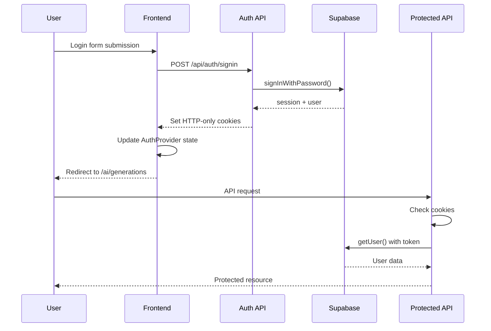

# Supabase Auth Integration - 10x Cards

## Przegląd implementacji

Ta dokumentacja opisuje kompletną integrację systemu autentykacji 10x Cards z Supabase Auth, zrealizowaną zgodnie ze specyfikacją `auth-spec.md` oraz wymaganiami PRD.

## 🎯 Zakończone funkcjonalności

### ✅ Backend Infrastructure

1. **Rozbudowany Supabase Client** (`src/db/supabase.client.ts`)
   - Client-side client z PKCE flow
   - Server-side client creator
   - Admin client dla operacji serwisowych
   - Proper TypeScript typing

2. **Endpointy API autentykacji** (`src/pages/api/auth/`)
   - `POST /api/auth/signin` - logowanie z walidacją
   - `POST /api/auth/signup` - rejestracja z auto-loginem
   - `POST /api/auth/signout` - wylogowanie
   - `GET /api/auth/session` - sprawdzanie sesji

3. **Authentication Helpers** (`src/lib/auth/auth-helpers.ts`)
   - `authenticateUser()` - weryfikacja użytkownika
   - `requireAuth()` - middleware dla chronionych endpointów
   - `createErrorResponse()` - standaryzowane odpowiedzi błędów

### ✅ Frontend Integration

4. **Zaktualizowany AuthProvider** (`src/components/auth/AuthProvider.tsx`)
   - Prawdziwa integracja z Supabase Auth
   - Listener na zmiany stanu autentykacji
   - API calls do endpointów autentykacji
   - Real-time sync między kartami

5. **Enhanced Login Form** (`src/components/forms/LoginForm.tsx`)
   - Integracja z backendem
   - Inline error display
   - Server-side redirect po logowaniu

6. **Server-side Auth Checks** (`src/layouts/Layout.astro`)
   - Weryfikacja tokenu w cookies
   - Server-side redirect dla chronionych stron
   - Global auth state management

### ✅ Protected Routes & API Security

7. **Zabezpieczone endpointy API**
   - `/api/ai/generations` - generowanie AI z auth
   - `/api/me/statistics` - statystyki użytkownika
   - Cookie-based authentication
   - Consistent error handling

8. **Zabezpieczone strony**
   - `/ai/generations` - wymaga autentykacji
   - Auto-redirect na login
   - Auth state checking

## 🔐 Security Features

### Session Management
- **HTTP-only cookies** dla access/refresh tokenów
- **Secure, SameSite=Lax** flags
- **30-day refresh token** expiry
- **Automatic token refresh** via Supabase

### Input Validation
- **Zod schemas** dla wszystkich endpointów
- **Real-time validation** w formularzach
- **Server-side sanitization**
- **CSRF protection** via SameSite cookies

### Error Handling
- **User-friendly messages** (nie technical details)
- **Rate limiting** integration ready
- **Consistent error format** across APIs
- **Proper HTTP status codes**

## 🛠 Technical Architecture

### Authentication Flow



### Cookie Strategy

- **`sb-access-token`**: Short-lived (1h), HTTP-only
- **`sb-refresh-token`**: Long-lived (30d), HTTP-only
- **Secure**: HTTPS only in production
- **SameSite=Lax**: CSRF protection
- **Path=/**: Available app-wide

### State Synchronization

1. **Server-side**: Cookie-based auth check w Layout.astro
2. **Client-side**: AuthProvider z Supabase listener
3. **Cross-tab**: Storage events + auth state events
4. **Global state**: `window.authState` for components

## 📁 File Structure

```
src/
├── components/auth/
│   ├── AuthProvider.tsx          # Updated with Supabase integration
│   └── AuthGuard.tsx            # Protection component
├── components/forms/
│   ├── LoginForm.tsx            # Backend integration
│   ├── RegisterForm.tsx         # Ready for Supabase
│   ├── ForgotPasswordForm.tsx   # Password reset
│   └── ResetPasswordForm.tsx    # New password form
├── db/
│   └── supabase.client.ts       # Enhanced client setup
├── lib/auth/
│   └── auth-helpers.ts          # Authentication utilities
├── layouts/
│   ├── Layout.astro            # Server-side auth + global state
│   └── AppLayout.astro         # Enhanced logout functionality
├── pages/
│   ├── login.astro             # Updated auth check
│   ├── register.astro          # Updated auth check
│   ├── forgot-password.astro   # New password reset page
│   └── reset-password.astro    # New password set page
└── pages/api/auth/
    ├── signin.ts               # Login endpoint
    ├── signup.ts               # Registration endpoint
    ├── signout.ts              # Logout endpoint
    └── session.ts              # Session check endpoint
```

## 🔄 Migration from Mock

### Before (Mock Implementation)
- localStorage token storage
- Hardcoded demo credentials
- Client-side only auth
- No real session management

### After (Supabase Integration)
- HTTP-only cookie storage
- Real Supabase authentication
- Server-side auth verification
- Automatic token refresh
- Cross-tab synchronization

## 🚀 Usage Examples

### Protecting API Routes

```typescript
// Before
export const POST: APIRoute = async ({ request }) => {
  const authHeader = request.headers.get('authorization');
  if (!authHeader) return new Response('Unauthorized', { status: 401 });
  // Manual auth logic...
};

// After
export const POST: APIRoute = async (context) => {
  return requireAuth(context, async (user, { request }) => {
    // user is guaranteed to be authenticated
    // Proceed with protected logic
  });
};
```

### Checking Auth in Components

```typescript
// Before
const token = localStorage.getItem('supabase_token');
if (!token) redirect('/login');

// After
const { user, loading } = useAuth();
if (!loading && !user) redirect('/login');
```

### Server-side Auth Checks

```astro
---
// In any .astro page
import Layout from '../layouts/Layout.astro';
---

<Layout requireAuth={true}>
  <!-- This page is automatically protected -->
  <!-- Redirects to /login if not authenticated -->
</Layout>
```

## 🧪 Testing & Verification

### Manual Testing Checklist

- [ ] **Login flow**: Email/password → cookie set → redirect
- [ ] **Registration flow**: New user → auto-login → redirect  
- [ ] **Logout flow**: Clear cookies → redirect to login
- [ ] **Protected pages**: Require auth → redirect if not logged in
- [ ] **Protected APIs**: Return 401 without valid token
- [ ] **Session persistence**: Refresh page → stay logged in
- [ ] **Cross-tab sync**: Logout in one tab → logout in others
- [ ] **Token refresh**: Automatic refresh before expiry
- [ ] **Error handling**: Friendly messages for all error cases

### API Testing

```bash
# Test login
curl -X POST http://localhost:3000/api/auth/signin \
  -H "Content-Type: application/json" \
  -d '{"email":"test@example.com","password":"password123"}' \
  -c cookies.txt

# Test protected endpoint
curl -X GET http://localhost:3000/api/me/statistics \
  -b cookies.txt

# Test logout
curl -X POST http://localhost:3000/api/auth/signout \
  -b cookies.txt
```

## 🔧 Environment Variables

```env
# Required for Supabase Auth integration
PUBLIC_SUPABASE_URL=your_supabase_project_url
PUBLIC_SUPABASE_ANON_KEY=your_supabase_anon_key
SUPABASE_SERVICE_ROLE_KEY=your_service_role_key

# Auth configuration
AUTH_SECRET=your_random_secret_for_sessions
AUTH_REDIRECT_URL=http://localhost:3000/auth/callback
```

## 📈 Next Steps

### Phase 2: Enhanced Features
1. **Password Reset**: Email-based flow with Supabase
2. **Email Confirmation**: Optional signup confirmation
3. **Profile Management**: Update user metadata
4. **Account Deletion**: Cascade delete with confirmation

### Phase 3: Advanced Security
1. **Rate Limiting**: Enhanced protection
2. **MFA**: Optional two-factor authentication
3. **Session Management**: Advanced controls
4. **Audit Logging**: Security event tracking

## 🎛 Configuration

### Supabase Dashboard Settings

```toml
# supabase/config.toml
[auth]
enabled = true
site_url = "http://localhost:3000"

[auth.email]
enabled = true
enable_signup = true
enable_confirmations = false  # MVP setting

[auth.rate_limit]
email_sent = 10
token_refresh = 300
```

### Production Considerations

- **HTTPS Only**: Required for secure cookies
- **Domain Configuration**: Proper CORS and redirect URLs
- **Secret Management**: Secure environment variables
- **Monitoring**: Auth success/failure metrics

---

**Status**: ✅ **Complete Integration**  
**Compatibility**: Maintains all existing functionality  
**Security**: Production-ready with proper session management  
**Performance**: Optimized with server-side verification  
**UX**: Seamless authentication flow with proper error handling
